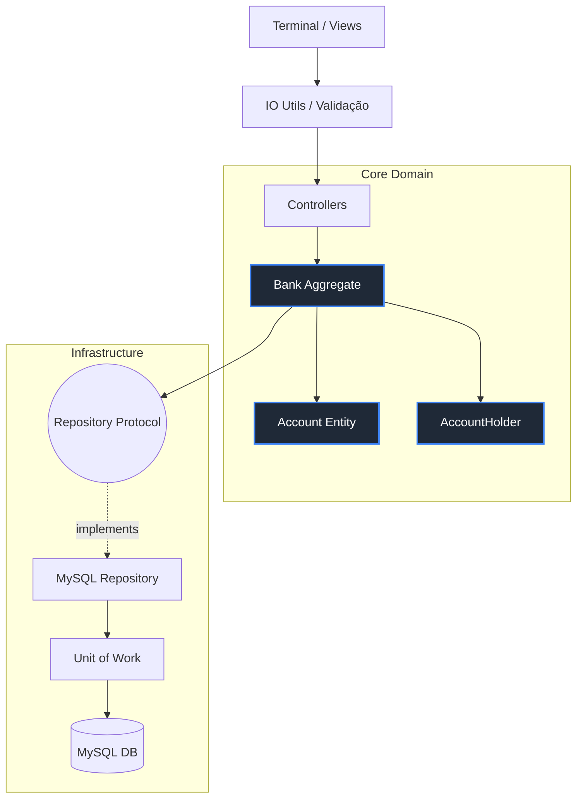

# 🏦 PyBank System 3.0

Uma aplicação bancária via linha de comando (CLI) desenvolvida em Python para explorar fundamentos de Arquitetura de Software, Concorrência de Dados e Segurança, sem a abstração de frameworks web.

## ⚡ Destaques Técnicos

* ✅ **Arquitetura em Camadas** isolando I/O, Casos de Uso e Regras de Negócio.
* ✅ **Persistência Desacoplada** utilizando o padrão *Repository*.
* ✅ **Tratamento de Concorrência** via *Unit of Work* e MySQL *Pessimistic Locks*.
* ✅ **Autenticação Stateless** com tokens criptográficos (HMAC-SHA256 + Bcrypt).
* ✅ **Design Defensivo (Fail-Fast)** com validação estrita de tipos e valores nas bordas.
* ✅ **Ambiente Conteinerizado** com Docker e Docker Compose.
* 🚧 *Testes Automatizados (Em desenvolvimento)*

---

## 📖 A Evolução do Projeto (O que eu aprendi)

Este projeto começou como um script simples de terminal e evoluiu para um laboratório de engenharia de software. O objetivo nunca foi reinventar a roda ou criar um "concorrente" para frameworks modernos, mas sim entender **por que** os padrões de projeto existem.

A evolução foi orgânica e baseada em dores reais durante o desenvolvimento:

* **A transição de JSON para MySQL:** O uso de arquivos JSON serviu para a prova de conceito inicial, mas não é o padrão da indústria para aplicações financeiras. A migração para um banco de dados relacional foi uma evolução deliberada para garantir integridade, tipagem estrita e alinhar o portfólio às tecnologias exigidas pelo mercado.
* **A escolha do Padrão Repository:** A separação de responsabilidades sempre foi uma premissa do projeto — lógicas de banco de dados *nunca* se misturaram com regras de negócio. O padrão *Repository* foi adotado proativamente por ser a solução de mercado ideal para atuar como uma Camada Anticorrupção (ACL), garantindo que o Domínio desconheça a infraestrutura de persistência.
* **A adoção do DDD e DTOs:** Com o amadurecimento do sistema, o *Domain-Driven Design* foi aplicado para isolar o coração bancário da aplicação. Para proteger essa fronteira, implementei *Data Transfer Objects* (DTOs), que atuam como o padrão de segurança e os únicos pacotes de informação autorizados a transitar entre as camadas externas (Views/Controllers) e o Core Domain.
* **Lidando com Concorrência na Prática:** Para cumprir os requisitos de segurança de um banco real, pesquisei e implementei o *Unit of Work* em conjunto com bloqueios pessimistas (`SELECT ... FOR UPDATE`), resolvendo na prática vulnerabilidades de concorrência como TOCTOU ( *Time-of-Check to Time-of-Use* ).

## 🏗️ Arquitetura e Decisões de Design

O sistema foi desenhado respeitando as fronteiras do *Domain-Driven Design (DDD)* e *Ports and Adapters*.



### Decisões Principais:

1. **Segurança Zero Trust (Sessões Stateless):** O sistema não guarda estado de sessão em memória. O acesso é gerido por `AuthToken` (para navegação básica) e `AccessToken` (para o cofre). O hash da senha via Bcrypt é embutido na assinatura HMAC do token, garantindo que uma alteração de senha invalide sessões ativas imediatamente.
2. **Global Exception Handler:** Padrão  *Intercept-and-Rethrow* . O sistema roda em "Kiosk Mode" (loop infinito). Erros de domínio ou banco de dados são capturados pelo Controller, mapeados para mensagens de interface seguras e o sistema retorna à tela inicial graciosamente, sem vazar  *stack trace* .

## ⚙️ Como Executar o Projeto

**Pré-requisitos:** Python 3.12+ e Docker instalados.

**1. Clone o repositório e acesse a pasta:**

```Shell
git clone https://github.com/Joziel-Freitas/bank-system-python.git
cd pybank
```

**2. Configure as Variáveis de Ambiente:**  
Crie uma cópia do arquivo de configuração:

```Shell
cp .env.example .env
```

**3. Suba o Banco de Dados (Docker):**  
O script `init.sql` será executado automaticamente na primeira inicialização, criando as tabelas e relacionamentos.


```Shell
docker-compose up -d
```

**4. Instale as dependências e rode a aplicação:**  
Recomenda-se o uso de um ambiente virtual (`venv`).


```Shell
pip install -r requirements.txt
python main.py
```

*Desenvolvido por Joziel Freitas da Silva.*
