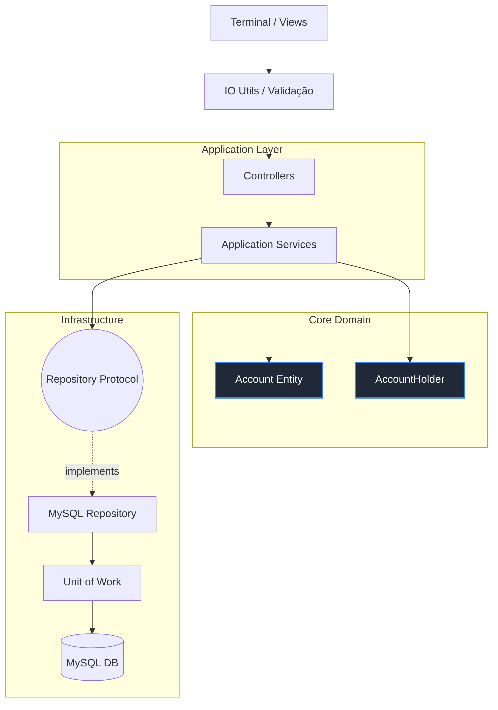

# 🏦 PyBank System 3.0

> **Clean Architecture & DDD High-Precision Terminal Banking Engine**
> *Uma aplicação bancária via linha de comando (CLI) de alta precisão, thread-safe e focada em segurança, desenvolvida em Python 3.12+ com MySQL 8.0 e Docker.*

[](https://www.python.org/)
[]()
[](https://www.mysql.com/)
[]()

---

## ⚡ Destaques Técnicos

- ✅ **Clean Architecture & DDD:** Isolamento total das regras de negócio (Core Domain) em relação a I/O, persistência e drivers externos.
- ✅ **Persistência Desacoplada (ACL):** Camada Anticorrupção (*Anti-Corruption Layer*) mapeando registros SQL em Snapshots imutáveis do Domínio.
- ✅ **Tratamento de Concorrência ACID:** Gerenciamento transacional via *Unit of Work* e mitigação de vulnerabilidades TOCTOU (*Time-of-Check to Time-of-Use*) utilizando *Pessimistic Locks* (`SELECT ... FOR UPDATE`).
- ✅ **Autenticação Stateless em Dois Estágios:** Gatekeeper de dois níveis (*Lobby* vs. *Vault*) com tokens criptográficos (HMAC-SHA256 + hashes Bcrypt e comparação em tempo constante).
- ✅ **Design Defensivo (Fail-Fast):** Validação estrita de tipos (PEP 695), limites numéricos e DTOs imutáveis nas fronteiras da aplicação.
- ✅ **Driver I/O Reativo de Baixo Nível:** Captura não-bloqueante no kernel do SO (`msvcrt` / `termios`) com timeouts duplos por inatividade e tempo de sessão.
- ✅ **Ambiente Conteinerizado:** Setup rápido de banco de dados via Docker e Docker Compose.
- 🚧 *Testes Automatizados (Em desenvolvimento)*

---

## 📖 A Evolução do Projeto (Do Exercício ao DDD)

Este projeto não nasceu como uma aplicação corporativa completa. Ele começou como um simples exercício acadêmico de terminal para fixar os conceitos básicos de Programação Orientada a Objetos (POO) com três classes fundamentais: `Banco`, `Pessoa` e `Conta`. Não havia banco de dados, interface tratada, segurança ou persistência.

Impulsionado pelo objetivo de transformar esse exercício simples em um laboratório real de engenharia de software, o projeto evoluiu de forma orgânica ao longo de três grandes eras:

1. **PyBank 1.0 (A Era da POO Pura):** O banco agregava clientes e contas em locais e dicionários em memória. Não havia persistência de dados. Foi o laboratório onde aprendi a projetar hierarquias de exceções personalizadas, dominar dunder methods (`__eq__`, `__hash__`, `__repr__`) e entender o ciclo de vida e a igualdade estrutural de objetos.
2. **PyBank 2.0 (Persistência e Padrões Iniciais):** Introdução de persistência via arquivos JSON (`JsonRepository`), variáveis de ambiente, módulos nativos do SO (`pathlib`, `os`, `sys`) e criação autônoma de um *Strategy Pattern* para validação e drivers de I/O. A arquitetura, porém, ainda mantinha um *God Object* (`Bank`) e controladores altamente acoplados ao estado interno das entidades.
3. **PyBank System 3.0 (Engenharia de Software de Produção):** Reescrita completa sob **Clean Architecture** e **Domain-Driven Design (DDD)**. O arquivo JSON foi substituído pelo **MySQL 8.0** com **Anti-Corruption Layer (ACL)** e **Unit of Work**; a segurança evoluiu para um **Modelo de Dois Estágios (Lobby vs. Vault)** assinado por **HMAC-SHA256** e hashes **Bcrypt**; e o acesso concorrente a saques foi blindado contra *race conditions* (**TOCTOU**) através de **Locks Pessimistas (`FOR UPDATE`)**.

---

## 🏗️ Arquitetura e Decisões de Design

O sistema adota estritamente os princípios da **Clean Architecture** e **Ports and Adapters (Arquitetura Hexagonal)** em 4 camadas desacopladas. A regra de dependência aponta sempre para dentro: **o Domínio é 100% puro e agnóstico a frameworks, bancos de dados ou bibliotecas externas.**

```text
              ┌─────────────────────────────────────────┐
              │           PRESENTATION LAYER            │
              │   (CLI Views, Controllers, I/O Driver)  │
              └────────────────────┬────────────────────┘
                                   │
                                   ▼
              ┌─────────────────────────────────────────┐
              │            APPLICATION LAYER            │
              │   (Services, Use Cases, Protocols, DTOs)│
              └────────────────────┬────────────────────┘
                                   │
                                   ▼
              ┌─────────────────────────────────────────┐
              │              DOMAIN LAYER               │
              │   (Entities, Value Objects, Snapshots)  │
              └────────────────────┬────────────────────┘
                                   │
                                   ▲
              ┌─────────────────────────────────────────┐
              │          INFRASTRUCTURE LAYER           │
              │   (MySQL ACL Repo, Cryptography, Driver)│
              └─────────────────────────────────────────┘
```

### Fluxo de Componentes (Mermaid Diagram)


```mermaid
graph TD
    UI[Terminal / Views] --> IO[IO Utils / Validação]
    IO --> Controller[Controllers]

    subgraph Application Layer
        Controller --> Services[Application Services]
    end

    subgraph Core Domain
        Services --> Account[Account Entity]
        Services --> Person[AccountHolder]
    end

    Services --> RepoInterface((Repository Protocol))

    subgraph Infrastructure
        RepoInterface -. implements .-> MySQLRepo[MySQL Repository]
        MySQLRepo --> UoW[Unit of Work]
        UoW --> DB[(MySQL DB)]
    end

    classDef domain fill:#1f2937,stroke:#3b82f6,stroke-width:2px,color:#fff;
    class Account,Person domain;
```

### Decisões Principais de Engenharia:

1. **Segurança Zero Trust (Sessões Stateless em Dois Estágios):**
    O sistema não guarda estado de sessão em memória. O acesso é gerido por dois níveis de tokens criptográficos:
    * **Gatekeeper do Lobby (AuthToken):** Permite navegação básica e depósitos públicos.
    * **Gatekeeper do Cofragem/Vault (AccessToken):** Eleva o nível de privilégio mediante verificação de senha de 6 dígitos. A assinatura do token combina HMAC-SHA256 com os hashes de Bcrypt armazenados no banco.

2. **Resiliência e Kiosk Mode (Global Exception Handler):**
    O quiosque da CLI opera em um loop infinito. Erros de domínio ou falhas de infraestrutura são interceptados no topo do controlador (`TerminalController`), exibindo mensagens amigáveis na interface e retornando à tela de boas-vindas sem interromper o processo ou vazar stack traces.

3. **Tratamento de Concorrência ACID:**
    Operações financeiras sensíveis (saques e transferências) utilizam um gerenciador de contexto *Unit of Work* combinado a bloqueios pessimistas (`SELECT ... FOR UPDATE`), garantindo que o saldo seja travado na linha da tabela durante a avaliação da simulação e a efetivação do débito.

---

## 🔐 Segurança & Criptografia

* **Hashes de Senha:** Utiliza `Bcrypt` com sal aleatório para armazenamento seguro de credenciais.
* **Assinatura de Tokens:** Utiliza `HMAC-SHA256` para validar a autenticidade e a integridade de `AuthToken` e `AccessToken`.
* **Mitigação de Timing Attacks:** Comparação de digests e assinaturas realizada em tempo constante com `hmac.compare_digest`.
* **Proteção Brute-Force:** Contador de tentativas mal-sucedidas com bloqueio e congelamento automático da conta (`is_frozen = True`) ao atingir 3 falhas consecutivas.

---

## 📂 Estrutura do Projeto

```text
pybank/
├── domain/                    # Domínio Puro (Zero dependências externas)
│   ├── entities/              # Account, CheckingAccount, SavingsAccount, Holder
│   ├── value_objects.py       # CPF, BranchCode, AccountNumber, LedgerEvent
│   ├── snapshots.py           # Snapshots imutáveis para reidratação ACL
│   └── types.py               # Aliases de Tipagem do Domínio (PEP 695)
├── application/               # Serviços de Aplicação & Casos de Uso
│   ├── services/              # Auth, Onboarding, Banking, Management
│   ├── dtos.py                # Data Transfer Objects com validação estrita
│   └── protocols.py           # Contratos de Repositório e Criptografia
├── infra/                     # Camada de Infraestrutura
│   ├── mysql_repository.py    # Repositório MySQL ACL & Unit of Work
│   ├── security.py            # PasswordHasher (Bcrypt) & TokenService (HMAC)
│   └── terminal_input.py      # Driver I/O de Baixo Nível para o Terminal
├── presentation/              # Camada de Apresentação & UI
│   ├── controllers/           # TerminalController, Auth, Banking, Management
│   ├── cli/                   # Views, Utilidades I/O, Catálogo de Mensagens
│   ├── dtos.py                # Service Container (Dependency Injection)
│   └── types.py               # Enums de Navegação e Schemas de Menu
├── settings.py                # Configurações Globais (12-Factor App)
├── main.py                    # Composition Root & Application Bootstrap
├── init.sql                   # DDL de Inicialização do Banco MySQL 8.0
├── docker-compose.yaml        # Containerização do Ambiente de Banco de Dados
└── .env.example               # Molde de Variáveis de Ambiente
```

---

## ⚙️ Como Executar o Projeto

### Pré-requisitos
* Python 3.12+
* Docker & Docker Compose

1. **Clonar o Repositório**
    ```bash
    git clone https://github.com
    cd pybank
    ```

2. **Configuração do Ambiente Virtual**
    ```bash
    python -m venv .venv

    # No Windows:
    .venv\Scripts\activate

    # No Linux/macOS:
    source .venv/bin/activate

    pip install -r requirements.txt
    ```

3. **Configurar as Variáveis de Ambiente**
    Crie uma cópia do arquivo de configuração do ambiente:
    ```bash
    cp .env.example .env
    ```
    Edite o arquivo `.env` para ajustar senhas ou segredos locais, se necessário.

4. **Subir o Banco de Dados (Docker)**
    O container MySQL 8.0 subirá automaticamente e executará o script `init.sql` na primeira inicialização para criar as tabelas e restrições:
    ```bash
    docker-compose up -d
    ```

5. **Executar a Aplicação**
    Inicie o terminal interativo do PyBank:
    ```bash
    python main.py
    ```

---

## 🛠️ Tecnologias e Recursos Utilizados

* **Linguagem:** Python 3.12+ (Typed Generics, PEP 695 type aliases, Structural Pattern Matching `match/case`).
* **Persistência & Banco de Dados:** MySQL 8.0 (Driver PyMySQL com DictCursor), transações ACID e Pessimistic Locking.
* **Segurança Criptográfica:** Bcrypt (Hashing salgado para senhas) e HMAC-SHA256 (Assinatura de Tokens).
* **Containerização:** Docker & Docker Compose.
* **Configuração:** Adere à metodologia 12-Factor App (`python-dotenv`).

---

## 🎯 Próximos Passos & Roadmap

Como projeto de aprendizado e aprimoramento contínuo em engenharia de software, os próximos passos do PyBank incluem:

* [ ] **Testes Automatizados:** Suíte de testes unitários e de integração com `pytest` (mockando a infraestrutura e testando invariantes do domínio).
* [ ] **API RESTful (FastAPI):** Criação de uma interface Web/API paralela à CLI, reaproveitando 100% dos Serviços de Aplicação e do Domínio.
* [ ] **Pipeline de CI/CD:** Automação de linting (`ruff`, `mypy`) e execução de testes via GitHub Actions.

---

## 💻 Autor

Desenvolvido por **Joziel Freitas da Silva**.

*Um laboratório prático de Engenharia de Software, arquitetura de sistemas e evolução contínua em Python.*
